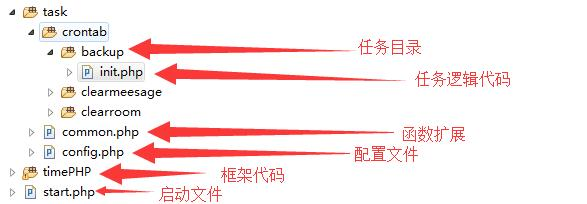

# timePHP

##timePHP用途？
timePHP是一个基于php cli开发的定时脚本框架,可以实现简单的配置,自己的逻辑代码纯php无需写shell脚本
易管理,易开发。简单的配置一下就可以根据需求开发自己的逻辑代码。

##timePHP操作命令
##全部启动命令
```
[root@iZbp1if228spaovivfbbyjZ CronTab]# php ./start.php start all &
[启动成功]
```
##单一启动命令
```
[root@iZbp1if228spaovivfbbyjZ CronTab]# php ./start.php start backup
[启动成功]
```
###关闭命令
```
[root@iZbp1if228spaovivfbbyjZ CronTab]# php ./start.php kill
[关闭成功]
```
###单一关闭命令
```
[root@iZbp1if228spaovivfbbyjZ CronTab]# php ./start.php kill backup
[关闭成功]
```
###查看命令
```
[root@iZbp1if228spaovivfbbyjZ CronTab]# php ./start.php select

----------------------- timePHP -----------------------------
timePHP version:1.0          PHP version:5.6.22
------------------------ timePHP -------------------------------
pid           name          status
1853          clearroom       [OK] 
1854          backup          [OK] 
1855          clearmeesage    [OK] 
-----------------------------------------------------------

```
##目录结构
 
###任务代码
例:
```
<?php
/**
 * 备份数据库
 * @author Administrator
 *  */
namespace Crontab;
class init{
    public static function _init(){
        $date = date("Ymd");
        foreach(C("TASK.backup")['dbArray'] as $db_name){
            $command ="mysqldump -u ".C("DB.DB_USER")." -p".replace_keyword(C("DB.DB_PWD"))." ".$db_name." >".C("TASK.backup")['target_dir'].$db_name."_".$date.".sql";
            shell_exec($command);
        }
        //删除 过期的数据库备份数据
        $past_time=C("TASK.backup")['target_dir'];
        for($i=$past_time;$i>=1;$i--){
            foreach(C("TASK.backup")['db_array'] as $db_name){
                $command="rm -rf ".C("TASK.backup")['target_dir'].$db_name."_".date("Ymd",time()-(($i+$past_time)*86400)).".sql";
                // shell_exec($command);//是否删除 过期的数据库
            }
        }
    }
}
```
##配置文件规范
```
例:
<?php 
/**
 * 任务进程中的配置文件
 * @author 码农<8044023@qq.com>
 *   */
return [
    //任务 id
    "TASK"=>[
        "clearmeesage"=>[
            "time"=>2,//时间周期 /秒
            "number"=>0,//序列号
            "name"=>"clearmeesage"//进程名 （和任务名一样）
        ],//清除短信中不要的垃圾数据 
        "clearroom"=>[
            "time"=>2,//时间周期 /秒
            "number"=>1,//序列号
            "name"=>"clearroom"//进程名 （和任务名一样）
        ],//清除房间中不要的垃圾数据
        "backup"=>[
            "time"=>2,//时间周期 /秒
            "number"=>2,//序列号
            "name"=>"backup",//进程名 （和任务名一样）
            "target_dir"=>"/home/bak/",//备份的路径
            "db_array"=>[//要备份的数据库
                "tourism_game",
                "tourism_game2"
            ],
            "past_time"=>9//过期时间/天
        ],//数据库定时备份
    ],
    "EXECUTE"=>["clearroom","backup","clearmeesage"],//需要启动的任务
    //数据库信息
    "DB"=>array(
        'DB_TYPE' => 'mysql',
        'DB_HOST' => 'localhost',
        'DB_NAME' => 'test',
        'DB_USER' => 'root',
        'DB_PWD' => 'root',
        'DB_PORT' => '3306',
        'DB_CODE'=>'utf8'
    ),
];
?>
```
##数据库操作
###查询单条
```
M("User")->where("id=1")->find();
```
###查询多条
```
M("User")->where("id=1")->select();
```
###删除一条
```
M("User")->where("id=1")->delete();
```
###获取总条数
```
M("User")->where("id=1")->count();
```
###修改
```
$data=array(
    'username'=>'小张',
    'password'=>md5(123456)	
);
M("User")->where("uid=1")->save($data);
```
###新增
```
$data=array(
    'username'=>'小张',
    'password'=>md5(123456)	
);
M("User")->add($data);//返回单条新增id
```
###筛选字段
```
M("User")->field('username')->where("id=1")->find();
M("User")->field('username')->where("id=1")->select();
```
###查询复杂的sql语句
$sql="select * from a left join b on a.id=b.id";
```
M()->execute($sql);
```
##公共函数
###获取配置信息
```
C('DB.type')
```
###打印
```
dump()
```
###替换特殊字符串
```
replace_keyword（$str）
```
##日志
###写入日志
```
Log::write($log);
```
日志路径:timePHP/error.log。
###自定义日志
```
"LOG"=>[//日志相关配置
        "log_path"=>"timePHP/",
        "log_file_size"=>2097152,
        "log_time_format"=>"c",
        "log_name"=>""
    ]
```
###日志格式
```
[警告][2017-01-20 16:19:51]\nFILE:D:\phpStudy\wwwroot\www.work.com\timePHP\lib\time\Course.php
LINE:27行
FUNCTION:run
LEVEL:2
CODE:703
MSG:你的操作命令错误
-------------------------------------------------------------------------------------------------
```

